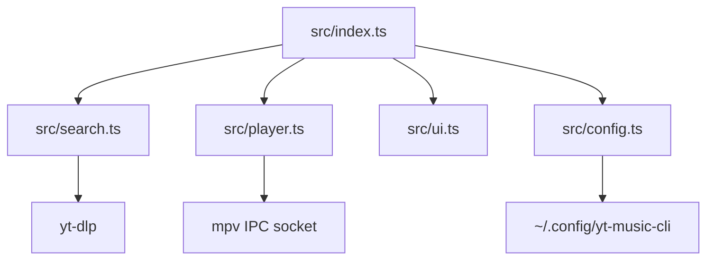

# Architecture

## Ust Seviye Bilesenler

## Modul Sorumluluklari

### `src/index.ts`

- Uygulamanin state machine'i burada
- Klavye input routing'i burada
- Ekranlar arasi gecis mantigi burada
- Queue, history, current track ve secim indeksleri burada tutuluyor

### `src/ui.ts`

- Tum terminal render fonksiyonlari burada
- ANSI escape sequence ve `chalk` kullaniliyor
- Arama, sonuclar, player, favoriler ve playlist ekranlari ayrik render ediliyor

### `src/player.ts`

- `mpv` child process baslatiliyor
- IPC socket uzerinden komut gonderiliyor
- `observe_property` ile player state senkronize ediliyor
- `end-file` ve `start-file` event'leri disari aktariliyor

### `src/search.ts`

- `yt-dlp` ile arama sonucu metadata cekiliyor
- YouTube Radio/Mix playlist'inden yeni kuyruk uretiliyor
- Gelen JSON satirlari `Track` tipine normalize ediliyor

### `src/config.ts`

- Favori ve playlist verisi diskten okunuyor
- JSON persistence burada
- Playlist CRUD ve duplicate kontrolu burada

### `src/types.ts`

- `Track` ve `Playlist` veri kontratlari burada tanimli

## Mimari Karakteri

- Tek process, tek entrypoint
- Merkezi in-memory state
- Ayrik ama hafif moduller
- UI ve is mantigi buyuk olcude `src/index.ts` icinde birlesik

## Teknik Borc / Dikkat Noktalari

> [!warning]
> Uygulama state'i buyudukce `src/index.ts` icindeki kosul ve ekran handler yogunlugu artiyor. Ileride ekran bazli modul ayirma veya daha resmi bir state machine yapisi faydali olabilir.

- i18n henuz yok; UI metinleri cogunlukla hardcoded
- Persistence katmani JSON dosyalarina dayali; migration katmani yok
- Search, queue ve UI davranislari test yerine agirlikla manuel checklist ile korunuyor
